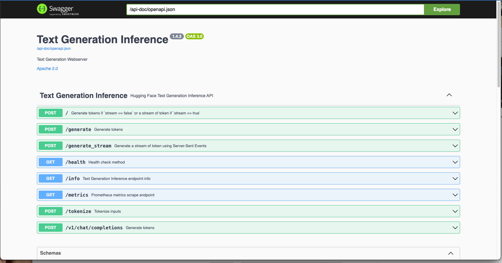

# AI on GKE using Pulumi Demo

This is a very basic tutorial on how to get started with GCP on Cloud. This is based on another tutorial I made with regards to [AI on GKE](https://github.com/jasonsmithio/ai-on-gke/tree/main/mixtral-on-gke).

This example will demostrate how to serve [Mixtral 8X7B](https://mistral.ai/news/mixtral-of-experts/ "Mixtral 8X7B") model on [NVIDIA L4 GPUs](https://cloud.google.com/compute/docs/gpus#l4-gpus "NVIDIA L4 GPUs") running on Google Cloud Kubernetes Engine (GKE). It will help you understand the AI/ML ready features of GKE and how to use them to serve large language models.

## What is Mistral?

Mixtral 8X7B is the latest LLM provided by [Mistral.ai](https://mistral.ai "Mistral.ai"). You can learn more about it [here](https://mistral.ai/news/mixtral-of-experts/). To interface with the model, we will be using [Hugging Face](https://huggingface.co/mistralai/Mixtral-8x7B-v0.1) and it's [text generation inference](https://huggingface.co/docs/text-generation-inference/en/index).

## Before we get started... 
Make sure you have access to a Google Cloud project that supports NVIDIA L4s in your desired region per your quotas. This tutorial uses `us-central1` but you can use a different one if you choose to do so. Also make sure that you have acceess to a terminal that can execute `kubectl`.

## Some Pre-requesites 

### Some Environment Variables

Before we get started, we will set a few basic environment variables in our terminal. This will make things easier for us as we move forward. Copy and paste the below snippet into your terminal. Be sure to set your `PROJECT_ID` and `NETWORK`. You may be able to set the network to *default* as there is usually a default network in a brand new environment.  

```bash
export PROJECT_ID=<your-project-id>
export REGION=<your region>
export ZONE=${REGION}-a 
export CLUSTER_NAME=mixtral-cluster
export NETWORK=<your network>
```

### Configuring the Google Cloud Platform (GCP) environment

Now that the variables are set, let's make sure that your GCP environment is setup and that you are authenticated. 

```bash
gcloud auth login 
gcloud config set project $PROJECT_ID 
gcloud config set compute/region $REGION
gcloud config set compute/zone $ZONE
gcloud auth application-default login
```

Now that we are authenticated, let's enable some APIs. Every resource in Google Cloud has an API that needs to be enabled. By default, new projects have all APIs turned off so if you are just getting started, it's important to turn them on. You only need to do this once. 

```bash
gcloud services enable \
	  cloudresourcemanager.googleapis.com \
	  compute.googleapis.com \
	  container.googleapis.com \
	  cloudbuild.googleapis.com \
	  containerregistry.googleapis.com
```

And finally, we'll do some IAM binding. In short, this will give our Kubernetes cluster the ability to write logs. 

```bash
PROJECT_NUMBER=$(gcloud projects describe $PROJECT_ID --format='value(projectNumber)')
GCE_SA="${PROJECT_NUMBER}-compute@developer.gserviceaccount.com"

gcloud projects add-iam-policy-binding $PROJECT_ID \
--member=serviceAccount:${GCE_SA} --role=roles/monitoring.metricWriter
gcloud projects add-iam-policy-binding $PROJECT_ID \
--member=serviceAccount:${GCE_SA} --role=roles/stackdriver.resourceMetadata.writer
```
This CAN be configured in Pulumi but for the purposes of this demo, we will set it in terminal. 


### Clone Demo Code from GitHub

In whatever directory you want to execute this code, run the below command in the terminal. It will pull down this GitHub repo and place you in the folder

```bash
git clone https://github.com/jasonsmithio/ai-gke-pulumi-demo
cd ai-gke-pulumi-demo
```

### Staging Pulumi Environment

The first thing we need to do is setup a Pulumi Stack

```bash
pulumi stack init
```

### Settings some variables

In our Python demo, we will be standing up a GKE Cluster. Pulumi allows us to [configur](https://www.pulumi.com/docs/concepts/config/) environment variables in a `Pulumi.<env>.yaml` file. While you can manually build the file, you can also just execute the commands below.

```bash
pulumi config set gcp:project $PROJECT_ID
pulumi config set gcp:projectNumber $PROJECT_NUMBER
pulumi config set gcp:gceSA $GCE_SA  
pulumi config set gcp:region $REGION
pulumi config set gcp:zone $ZONE
pulumi config set gcp:gkeNetwork $NETWORK
pulumi config set gcp:clusterName mixtral-gke-cluster
pulumi config set gcp:master_version 1.27
pulumi config set gcp:node_count 5
pulumi config set gcp:node_machine_type n2d-standard-4
```

Notice how we are using some of the variables we set earlier.


## Pulumi and Python

You will see that I have a `__main__.py` file in the root. This program will tell Pulumi to build a Kubernetes cluster with machine type *n2d-standard-4*. It will also create a separate nodepool with *g2-standard-24* machines. This machine type is needed to run the [NVIDIA L4s](https://cloud.google.com/blog/products/compute/introducing-g2-vms-with-nvidia-l4-gpus).

Once completed, it will create a [kubeconfig](https://kubernetes.io/docs/concepts/configuration/organize-cluster-access-kubeconfig/) so that we can access the cluster. In the `k8s` directory, you will see that I created a `mixtral.py` file. This Python module will deploy the Kubernetes deployment and a service. While [Gateways](https://kubernetes.io/docs/concepts/services-networking/gateway/) are the current best practice for exposing a Kubernetes workload, for the purposes of this demo, we are using a [LoadBalancer](https://kubernetes.io/docs/tasks/access-application-cluster/create-external-load-balancer/).

The `mixtral.py` module is just a containerized version of the `mixtral-huggingface.yaml` file in the same directory. The file looks like this

```yaml
apiVersion: apps/v1
kind: Deployment
metadata:
  name: mixtral-8x7b
spec:
  replicas: 1
  selector:
    matchLabels:
      app: mixtral-8x7b
  template:
    metadata:
      labels:
        app: mixtral-8x7b
    spec:
      containers:
      - name: mixtral-8x7b
        image: ghcr.io/huggingface/text-generation-inference:1.4.2
        resources:
          limits:
            nvidia.com/gpu: 2
        ports:
        - name: server-port
          containerPort: 80
        env:
        - name: MODEL_ID
          value: mistralai/Mixtral-8x7B-v0.1
        - name: NUM_SHARD
          value: "2"
        - name: MAX_BATCH_TOTAL_TOKENS
          value: "1024000"
        - name: MAX_BATCH_TOKENS
          value: "32000"
        - name: PYTORCH_CUDA_ALLOC_CONF
          value: "max_split_size_mb:512"
        - name: QUANTIZE
          value: "bitsandbytes-nf4"
        #- name: PORT
        #  value: "3000"
        volumeMounts:
          - mountPath: /dev/shm
            name: dshm
          - mountPath: /data
            name: data
      volumes:
         - name: dshm
           emptyDir:
              medium: Memory
         - name: data
           hostPath:
            path: /mnt/stateful_partition/kube-ephemeral-ssd/mistral-data
---
apiVersion: v1
kind: Service
metadata:
  name: mixtral-8x7b-service
  namespace: default
spec:
  type: LoadBalancer
  ports:
  - port: 80
    targetPort: 80
  selector:
    app: mixtral-8x7b
```

Now I want to let you in on a secret. I didn't convert the YAML manifest manually. I used a neat tool called[`pulumi convert`](https://www.pulumi.com/docs/cli/commands/pulumi_convert/). I ran the command `pulumi convert --from kubernetes --language python` and it generated a Python file that I was then able to convert. 

## Standing Up Our Pulumi Environment

We will execute now let Pulumi take our Python program and deploy

```bash
pulumi up
```

### Testing

At this point, you should be able to access the model via URL. You may be curious, what can you do now. Well let's look at the documentation. 

This step is also a good way to test if your model is running. Let's get the IP address of our service. 

```bash
URL=$(kubectl get service mixtral-8x7b-service -o jsonpath=’{.status.loadBalancer.ingress[0].ip}’)
echo “http://${URL}/docs"
```

The `echo` command will give you a URL that you can copy and paste into your browser. You should see something like this. 



If you see something similar to that image, congratulations, everything is working. If not, give it another 5 or so minutes and try again. 

If you click around, you can get sample documentation to show you how to call the Mixtral APIs and use the LLM. For example, choose the very first option. It will say `POST /`. You will see an option that says *Try It Out*. Click that and then a sample JSON body will apear. Click execute and it will run and give you a response. 

If you want to do a real test, choose the `/generate` option. 

```json
{
 "inputs": "[INST] You are a helpful, respectful and honest assistant. Always answer as helpfully as possible, while being safe. Your answers should not include any harmful, unethical, racist, sexist, toxic, dangerous, or illegal content. Please ensure that your responses are socially unbiased and positive in nature. If a question does not make any sense, or is not factually coherent, explain why instead of answering something not correct. If you don’t know the answer to a question, please don’t share false information. What is a Kubernetes secret?[/INST]",
 "parameters": {
 "best_of": 1,
 "do_sample": true,
 "max_new_tokens": 400,
 "repetition_penalty": 1.03,
 "return_full_text": false,
 "temperature": 0.5,
 "top_k": 10,
 "top_n_tokens": 5,
 "top_p": 0.95,
 "truncate": null,
 "typical_p": 0.95,
 "watermark": true
 }
}
```


## Clean Up

This LLM on GKE experiment will be expensive so once you are done, you will want to delete it. You can do this simply by running the following command. 

```bash
pulumi destroy
```

choose `Y` to destroy and in about 15-30 minutes, everything will be removed. 